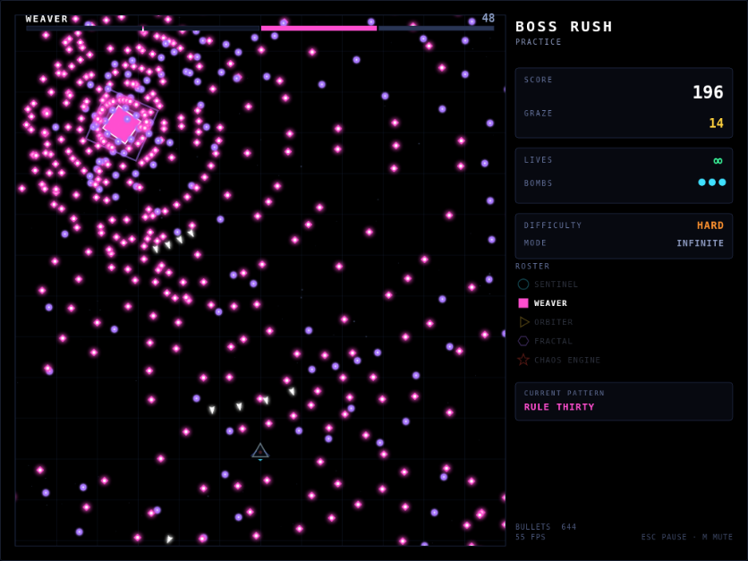
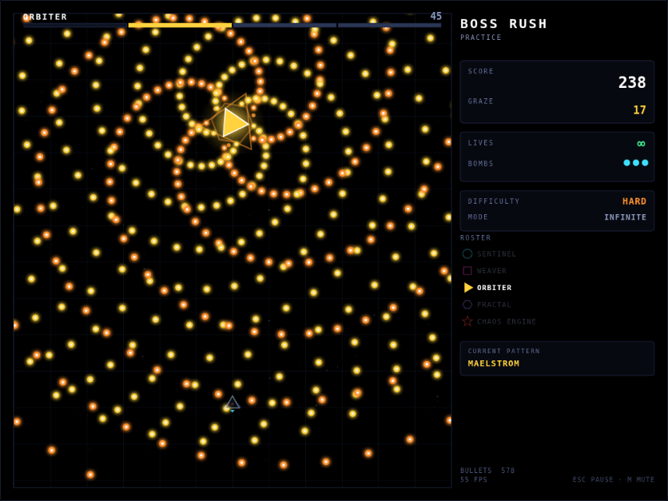
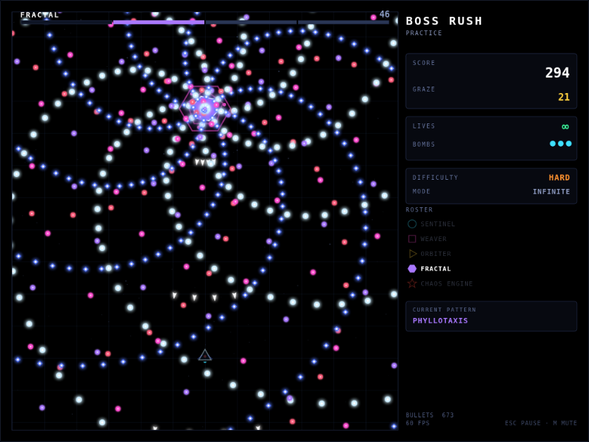
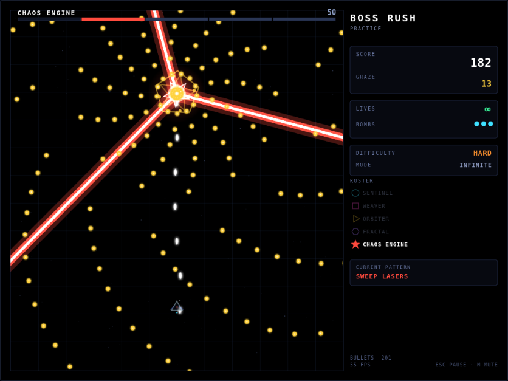

# Bullet Hell — Boss Rush

A canvas bullet-hell boss rush built from basic shapes on black. Five bosses,
twenty patterns, and every bullet curtain generated algorithmically — cellular
automata, logistic-map chaos, polar rose curves, phyllotaxis, logarithmic
spirals, recursive splitting and ballistic arcs — rather than hand-placed.

No dependencies, no build step, no assets. Plain ES modules and a 2D canvas.



## Running it

```bash
python3 serve.py          # then open http://localhost:8000
```

A server is needed because ES modules will not load over `file://`. If you would
rather have something you can just double-click:

```bash
python3 build.py          # writes dist/index.html, a single self-contained file
```

## Controls

| Key | Action |
| --- | --- |
| Arrows / WASD | Move |
| **Shift** (hold) | Focus — half speed, the ship's heavy armament, hitbox shown |
| **Z** | Fire (hold) — unfocused mixes straight, spread and homing |
| **X** / Space | Bomb — clears bullets, damages the boss, grants invulnerability |
| **Esc** / P | Pause |
| Shift + **R** | Restart the current boss |
| **M** | Cycle sound |

Space bombs rather than fires. With autofire on by default the fire key is
barely touched, while a bomb is the one thing you reach for in a panic, so the
biggest key on the keyboard belongs to it.

Menu options worth knowing about:

| Option | |
| --- | --- |
| **SHIP** | Four loadouts — see [Ships](#ships). They differ in what they shoot, never in how fast they move. |
| **AUTOFIRE** | Fire without holding anything. On by default; holding Z still works. |
| **AUTOPILOT** | A dodging bot plays for you. It is the same bot `npm run survive` uses to prove patterns are dodgeable, and it only ever produces inputs a human has — nine headings, focused or not, at the game's own speeds. Bombs and pause stay yours. |
| **SHOT OPACITY** | Dim your own shots (down to hidden) so enemy bullets read more clearly in dense patterns. |
| **SOUND** | Three levels: **ON**, **NO SHOTS**, **OFF**. `M` cycles them. |
| **MUSIC** | Volume for whatever you put in `music/` — see [Music](#music). |

**NO SHOTS** silences your own gun — the shot going out and the shot landing —
and keeps everything else. Autofire is twenty shots a second, so that pair is
most of what you hear; muting only one of them would not be worth a setting.

Only the small red dot at your centre collides; the hull is decoration. Passing
close to a bullet without dying scores a **graze**, which is where most of your
points come from.

## Modes

**Five difficulties.** Difficulty is not just a speed slider. Each level scales
bullet speed, bullet count and volley rate — and, crucially, enables another
*layer* of each pattern. A pattern on Lunatic has sub-patterns that simply do
not exist on Normal, so the fights differ in structure, not only in numbers.

| | Speed | Density | Rate | Extra layers | Aim |
| --- | --- | --- | --- | --- | --- |
| Novice | ×0.72 | ×0.55 | ×1.50 | 0 | loose |
| Easy | ×0.86 | ×0.76 | ×1.22 | 1 | loose |
| Normal | ×1.00 | ×1.00 | ×1.00 | 2 | fair |
| Hard | ×1.14 | ×1.32 | ×0.84 | 3 | leading |
| Lunatic | ×1.30 | ×1.70 | ×0.70 | 4 | perfect, leading |

**Three life modes**, granted *per boss* so every fight starts on equal footing:
Infinite (deaths cost score only), 3 Lives, and 1 Life.

Both are selectable from the main menu and from the pause menu mid-fight.

## The bosses

Each boss has three to five patterns. Depleting a pattern's health bar clears
the screen and advances to the next. **There is no time limit** — a pattern
ends when its health does. Each one still has a par time, and clearing under
par is what pays the speed bonus.

That works because the two firing stances trade damage against attention.
Every ship's **unfocused** loadout mixes straight, spread and homing fire, and
enough of it lands without aiming that you can give the screen your whole
attention and still make steady progress: dodging a pattern and never focusing
clears it in about its par time. **Focusing** is the ship's specialty, worth
roughly two to three times as much — but only while you stand where the boss is.

The one exception is Chaos Engine's final pattern, which is a **survival**
phase: there the clock is the win condition, and running it out is the clear.

### 1 · SENTINEL — *Rotational Primer*
Clean rotational geometry. Precessing rings, two counter-wound spiral arms whose
reversal bunches them into a wall, and expanding regular polygons — each bullet
rides its own edge's outward normal, so the polygon keeps straight edges as it
grows — with a rotating notch to aim for.

### 2 · WEAVER — *Lattice Interference*
Grids and interference. Crossing walls with gaps that move diagonally; two
orbiting satellite emitters whose overlapping sprays produce a live moiré field;
a ring of cells running **elementary cellular automaton rule 30**, whose live
cells become bullets, so the volley is deterministic but never repeats (rule 90
rides underneath at higher difficulties, laying clean Sierpiński triangles over
the chaos); and finally bullets that ricochet off the walls into a standing
lattice.



### 3 · ORBITER — *Ballistics & Vortices*
Physics. Bullets lobbed on gravity arcs that cross where they land; a vortex
built by launching at a fixed pitch angle to the radius, which is what actually
draws a logarithmic spiral; concentric batteries that latch into orbit, spin up
while you watch, then fire outward one gear at a time; and mirrored fans of
constant-curvature arcs with a few genuine seekers mixed in.

### 4 · FRACTAL — *Recursive Bloom*
Recursion and parametric curves. Shells that split, and whose children split
again, two or three generations deep. A phyllotaxis phase pairing a golden-angle
stream — the most *irrational* rotation, so it never forms arms and instead
spreads the most even curtain a single emitter can make — against a ring of
eight precessing by a hair, which is about as rational as a rotation gets and
does draw arms. An emitter that walks the polar rose `r = cos(kθ)` and fires
along the local radius, so the bullets literally draw the rose before unfolding
it. And a dense ring that freezes mid-flight, shimmers, then relaunches straight
at wherever you happen to be standing.



### 5 · CHAOS ENGINE — *Deterministic Ruin*
The finale. Firing angles taken from iterates of the logistic map at r = 3.94 —
fully deterministic, never periodic. Rotating beam sweeps over a pellet curtain.
Three emitters riding Lissajous curves across the field. Bullets converging
inward from the border while a ring accelerates outward. Then a 40-second
**survival** phase where the boss is invulnerable and four generators run at
once on a single clock.



<a id="ships"></a>
## Ships

Four loadouts, chosen in the menu. Movement speed is identical across the
roster — they differ in what they shoot, not how they dodge, which is also what
keeps the autopilot's planning valid for all of them.

Only fans and seekers are aimed at the boss when they leave the ship. Straight
lanes are not: lining them up is the entire cost of using them, and it is why
the two ships built around them are the slowest while dodging and the fastest
once planted.

| Ship | Unfocused | Focused | |
| --- | --- | --- | --- |
| **VECTOR** | 1 straight · 2 spread · 2 homing | two forward lanes | Balanced. Good everywhere, best nowhere. |
| **TRACER** | 3 homing · 2 spread | three seekers | Lands wherever you are. Least punished for bad position, least rewarded for good. |
| **BLOOM** | 4 spread · 1 homing | a five-wide fan | Forgiving aim. The fan spends its outer shots on empty space at range. |
| **LANCE** | 2 straight · 1 spread · 1 homing | one heavy bolt | Highest ceiling, no margin. Dead weight unless you are under the boss. |

Measured with `npm run ships`, as a multiple of par time (lower is faster):

| | dodging, never focused | lined up, focused |
| --- | --- | --- |
| VECTOR | 1.00 | 0.49 |
| TRACER | 0.93 | 0.46 |
| BLOOM | 1.06 | 0.60 |
| LANCE | 1.15 | 0.35 |

The per-phase columns matter more than the totals: BLOOM and LANCE are almost
exactly anti-correlated, because the patterns where the boss stands still are
the ones where straight lanes land and a long-range fan wastes its edges.

<a id="music"></a>
## Music

The game ships with none, and stays silent until you add some. To add tracks:

```bash
cp ~/some-track.mp3 music/
```

That is the whole step. A browser cannot list a directory, so the game reads a
manifest — but the manifest is **generated**, not maintained by hand: `serve.py`
builds it per request, and `build.py` and the Vercel build write it at build
time. Uploading a track through the GitHub web UI works as well as adding one
locally, which an earlier version of this got wrong.

By default every track joins one rotation that advances on each scene change.
To pin one to a scene, run `npm run music` to write `music/tracks.json`, then
add a `for` field to its entry:

```json
{
  "tracks": [
    { "file": "opening.mp3", "title": "Opening", "for": "menu" },
    { "file": "sentinel.mp3", "title": "Sentinel", "for": "boss1" },
    { "file": "drift.mp3", "title": "Drift" }
  ]
}
```

Valid values are `menu`, `boss1` … `boss5` and `results`. A scene with nothing
pinned to it falls back to the rotation, so pinning some tracks and not others
works fine. `"loop": false` plays an entry once instead of looping.

Every generator **merges**: hand-added fields survive, and only new files are
added and vanished ones dropped. `npm run music` is the only one that writes to
the repository; the rest generate in memory or into their build output.

Tracks stream from an `<audio>` element rather than decoding into WebAudio
buffers — a decoded three-minute track is ~30MB of `Float32Array` and has to
download in full before a note plays. The cost of streaming is that music lives
outside the sound-effect mixer, which is why it has its own volume setting
rather than riding the SOUND level.

Audio in `music/` is committed by default, because a Vercel deploy builds from
the repository and anything uncommitted would not reach the site. To keep audio
out of git instead, uncomment the `music/*.mp3` line in `.gitignore` and deploy
with `vercel deploy` from your working copy.

<a id="deploying"></a>
## Deploying

The game is static files, so any static host will serve it. For Vercel, import
the repository and accept the defaults — `vercel.json` already sets everything:

| | |
| --- | --- |
| Install | skipped — there are no runtime dependencies |
| Build | `node tools/vercel-build.mjs` |
| Output | `public/` |

The "build" only copies `index.html`, `styles.css`, `src/` and `music/` into
`public/`. There is nothing to compile; the point of the step is that the
deployed file set is explicit and checkable rather than "the repository, minus
whatever `.vercelignore` happens to exclude". It uses Node and no Python, so it
does not depend on what the build image happens to include.

```bash
npm run vercel-build       # then serve public/ to see exactly what deploys
```

`src/*.js` is served `must-revalidate` because the filenames are not content
hashed — a long cache would strand players on an old build. `music/` is
immutable and cached for a year.

## How patterns are written

Patterns are generator functions that `yield` a number of frames to wait, which
lets densely-timed choreography read as straight-line code:

```js
function* cardinalBloom(A) {
  A.st({ shape: 'circle', color: C.cyan, r: 6 });
  let k = 0;
  while (true) {
    const n = A.n(11, 6);                       // count, scaled by density
    A.ring({ n, speed: A.spd(2.15), angle: k * 0.37 });

    if (A.L(1)) {                               // Easy and above
      A.ring({ n, speed: A.spd(1.45), angle: -k * 0.37 + 0.2, color: C.blue });
    }
    if (k % 3 === 2) {
      A.fan({ n: A.n(5, 3), spread: 0.42, speed: A.spd(3.6),
              angle: A.aimLead(undefined, undefined, 3.6),
              shape: 'kunai', color: C.white });
    }
    k++;
    yield A.w(26);                              // delay, scaled by rate
  }
}
```

Difficulty threads through five helpers — `A.n()` scales counts, `A.spd()`
scales velocity, `A.w()` scales delays, `A.gap()` scales delays *between
waves*, and `A.L(k)` gates a whole optional sub-pattern. That last one is what
makes the difficulties structurally different.

`A.gap()` exists because of a mistake worth not repeating. Some patterns are
hard because of how many waves are in flight at once rather than how dense one
wave is, and for those, `A.w()` alone does nothing: a wave stays on screen for
about `span / speed` frames, so scaling the gap by `rate` very nearly cancels
the speed change and every difficulty ends up with the same overlap. Chaos
Engine's Convergence ran 7.1 overlapping waves on Novice against 8.3 on
Lunatic. `A.gap()` divides by speed as well, and clamps so it only ever eases —
Normal is the reference tuning and the tiers above it keep the gap they were
designed with.

The same trap catches any layer whose *count* does not go through `A.n()`.
Final Theorem emitted one bullet per frame unconditionally, so it put 784
bullets on screen at Novice and 809 at Lunatic — a 3% difficulty range on a
phase where every other pattern spans sixfold. Anything spawned at a fixed rate
needs its rate scaled, or the easier tiers get slower bullets and more of them.

Bullet behaviour is data, not closures, so the pool stays allocation-free while
still supporting gravity (`ax`/`ay`), constant-curvature steering (`turn`,
`turnDecay`), speed ramps (`accel`, `minSpeed`, `maxSpeed`), stop-and-snap
(`stopT`, `goT`, `goMode`), wall bounces (`bounce`), soft homing (`homeT`,
`homeK`), orbit-then-release (`orbit`) and recursive splitting (`split`).

## Layout

```
index.html          styles.css        serve.py     build.py
src/
  main.js           bootstrap, fixed-timestep loop, canvas sizing
  game.js           scenes, run state, collisions, HUD
  boss.js           phase state machine, coroutine runner
  attack.js         the pattern-authoring API (A.ring, A.fan, A.polyRing, ...)
  patterns.js       shared movement scripts, cellular automata, logistic map
  bullets.js        data-driven bullet pool
  autopilot.js      the dodging bot: in-game autopilot and test harness
  ships.js          the ship roster, as weapon-component data
  music.js          streams whatever mp3s are in music/
  player.js  lasers.js  particles.js  sprites.js
  ui.js  input.js  audio.js  storage.js  config.js  mathx.js  rng.js
  bosses/boss1..5.js
musicscan.py        the music manifest scanner, shared by serve.py and build.py
tools/
  smoke.mjs         headless play-through of every boss at every difficulty
  census.mjs        per-phase bullet-count and frame-cost report
  ships.mjs         per-ship clear time, dodging vs lined up
  audiokeys.mjs     sound levels, key bindings, the music drop-in path
  autopsy.mjs       what kills you on one phase, and how pressure builds
  music.mjs         the music manifest scanner, and a CLI to write it out
  vercel-build.mjs  assemble public/ for a static deploy
  shots.mjs         screenshot every phase
  probe.mjs         damage throughput and phase pacing
```

## Development

```bash
npm install         # playwright, for the headless tests only
npm test            # drives every boss at every difficulty in Chromium
npm run survive     # can a player actually dodge each pattern?
npm run margins     # how much dodging room each pattern really has
npm run deadzones   # can you park anywhere and ignore a pattern?
npm run autopsy -- --boss 5 --phase 4   # why is this phase hard?
npm run bot         # autopilot quality: survival, gap width, idle drift
npm run ships       # is every ship worth picking?
npm run audio       # sound levels, key bindings, music end to end
npm run music       # write music/tracks.json, for pinning tracks to scenes
npm run census      # per-phase bullet counts and render cost
npm run lint
```

`npm test` boots the game in headless Chromium, steps the fixed-timestep loop by
hand (so results do not depend on wall-clock speed), and fails on any console
error, page exception, stalled pattern script, runaway bullet count or broken
menu transition. `npm run census` is the balancing tool — it runs each of the 20
patterns in isolation and reports peak concurrent bullets and frame cost per
difficulty.

Every pattern is seeded per boss/phase/difficulty, so a given fight plays back
identically each attempt.
